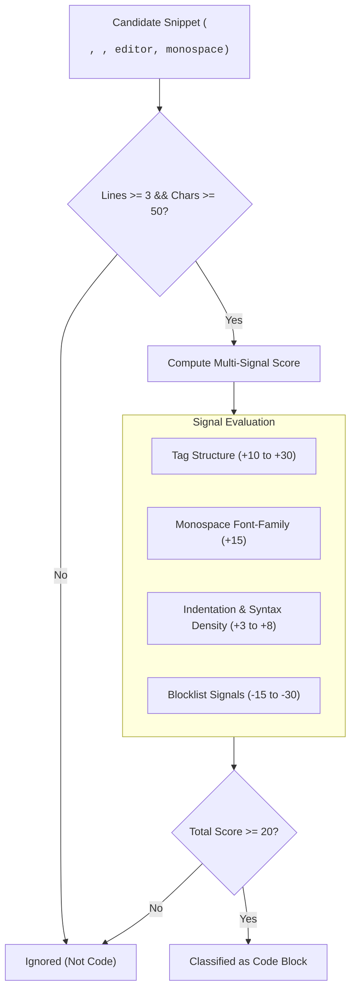
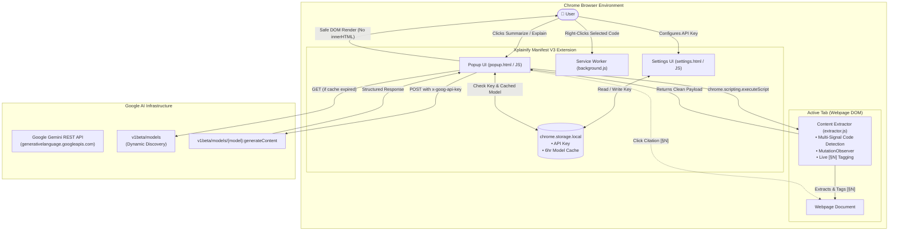

# Xplainify

<div align="center">

[](https://opensource.org/licenses/MIT)
[](https://developer.chrome.com/docs/extensions/mv3/intro/)
[](https://github.com/SiddheshK1704/Xplainify)
[](https://ai.google.dev/)

**Understand before you read.**

An editorial, developer-grade Chrome extension that transforms dense articles, documentation, and technical code into clear, verifiable insights. Powered directly by Google Gemini with zero intermediate servers.

[Quick Start](#installation) • [How It Works](#how-it-works) • [Architecture](#architecture) • [Usage Guide](#usage-guide) • [FAQ](#faq--troubleshooting)

</div>

---

> **Note**: Demo walkthrough preview coming soon.

---

## Why Xplainify?

The modern web is overwhelmed with cognitive overhead: long-form documentation, sprawling technical blogs, and walls of code that demand precious time just to determine relevance.

Most AI summarizers fail because of two critical shortcomings:
1. **The Hallucination & Black-Box Problem**: Generic summarizers output statements with no attribution. You cannot verify whether the AI accurately summarized the author's words or hallucinated critical claims.
2. **Third-Party Data Middlemen**: Typical extensions route your browsing content and API requests through proprietary backend proxy servers, introducing latency, privacy vulnerabilities, and service downtime.

**Xplainify solves both problems by design:**
- **Grounded Verification**: Every summarized takeaway includes an interactive citation (`[§N]`). Clicking any citation smoothly scrolls the host page directly to the exact source paragraph and highlights it with a visible indicator.
- **Direct Browser-to-Gemini Architecture**: Xplainify operates with **zero backend servers**. Every request travels directly from your browser to Google's Gemini REST API using your personal API key stored strictly in local Chrome storage.

---

## How It Works

Xplainify is engineered as a lightweight, high-signal client utility. It employs deterministic algorithms for extraction, multi-signal code classification, live mutation observation, and model resolution before passing data to Gemini.

```
┌─────────────────┐       ┌─────────────────┐       ┌─────────────────┐
│   Active Tab    │ ───>  │ Extraction &    │ ───>  │  Google Gemini  │
│   (Host DOM)    │       │ Scoring Engine  │       │    REST API     │
└─────────────────┘       └─────────────────┘       └─────────────────┘
         ▲                                                   │
         │             Interactive Citations [§N]            │
         └───────────────────────────────────────────────────┘
```

### 1. Canonical Extraction Pipeline
Extracting readable content from arbitrary web pages requires aggressive noise filtering and layout normalization without breaking client-side single-page applications (SPAs).

```
Host DOM  ──>  Target Container  ──>  Noise Filtering  ──>  Direct Live [§N] Tagging  ──>  Budget Controller
```

- **Target Container Resolution**: Probes high-signal semantic landmarks first (`article`, `main`, `[role="main"]`, `#mw-content-text`, `.theme-doc-markdown`, `.markdown-body`, `.post-content`, etc.), falling back gracefully to `document.body`.
- **Accurate Live DOM Tagging**: Identifies non-noise content paragraphs and tags live DOM elements directly with `data-xplainify-src="${index}"`, guaranteeing an exact 1-to-1 match between the summary citations and on-page DOM elements.
- **Aggressive Noise Stripping**: Filters out over 25 clutter selectors, including scripts, styles, iframes, SVGs, audio/video elements, navbars, sidebars, headers, footers, comment sections, social share bars, cookie/consent banners, and modal dialogs.
- **Semantic Tree Normalization**: Traverses clean heading tags (`h1`–`h6`), paragraphs (`p`), list elements (`ul`, `ol`), and code blocks (`pre`), preserving document hierarchy.
- **Character Budget Controller**: Adheres to a target length of 12,000 characters with a hard boundary at 16,000 characters, terminating cleanly at sentence or word boundaries to prevent token spillover and ensure sub-second response times.

### 2. Multi-Signal Code Detection & MutationObserver
Many documentation sites and wikis mix technical code snippets with false positives such as mathematical equations, phonetic pronunciations (IPA), bibliographic references, and tabular infoboxes.

Xplainify evaluates every candidate snippet against a multi-signal **weighted scoring model** ($\ge 20$ threshold, $\ge 3$ lines, $\ge 50$ characters):



| Signal Type | Evaluated Pattern | Score Weight | Rationale |
|---|---|---|---|
| **Structural** | `<pre><code>` nested hierarchy | `+30` | Canonical HTML5 code presentation |
| **Structural** | Embedded code editors (`.cm-editor`, `.monaco-editor`, `.ace_editor`) | `+30` | Interactive web IDEs and sandboxes |
| **Structural** | Highlighter classes (`hljs`, `highlight`, `shiki`) | `+25` | Syntax highlighting libraries |
| **Structural** | Language classes (`language-*`, `lang-*`) | `+25` | Explicit CSS language notation |
| **Structural** | Platform code containers (GitHub blob, Stack Overflow `s-code-block`) | `+25` | Known developer platforms |
| **Structural** | Data attributes (`data-lang`, `data-language`) | `+20` | Explicit semantic metadata |
| **Monospace** | Computed monospace font (`Consolas`, `Monaco`, `Fira Code`, `JetBrains Mono`) | `+15` | Computed font-family inspection |
| **Structural** | Standalone `<pre>` without nested `<code>` | `+10` | Formatted preformatted text |
| **Content** | Consistent indentation ($\ge 3$ lines with leading whitespace) | `+8` | Distinctive code structure |
| **Content** | Keyword density (`const`, `func`, `import`, `class`, `def`, etc. $\ge 3\%$) | `+5` | Programming syntax presence |
| **Content** | Operator / bracket density (`{}[]()=>===;` $\ge 3\%$) | `+5` | Algorithmic syntax presence |
| **Blocklist** | Math markup (`katex`, `MathJax`, `mwe-math-element`, `role="math"`) | `-30` | Eliminates mathematical notation |
| **Blocklist** | Citations & references (`citation`, `reference`, `reflist`, `toc`) | `-30` | Eliminates bibliographic footnotes |
| **Blocklist** | Phonetics & unicode (`IPA`, `unicode`) | `-30` | Eliminates dictionary pronunciations |
| **Blocklist** | Data tables & sidebars (`wikitable`, `infobox`, `navbox`) | `-15` | Eliminates tabular data false positives |

- **Live `MutationObserver` Support**: Code blocks dynamically injected by Single Page Applications (e.g. GitHub PJAX transitions, Next.js client-side routing, documentation search lazy-loading) are continuously detected and broadcast to the extension UI in real time.

### 3. Grounded Click-to-Source Citations
When Gemini generates a webpage breakdown, it is strictly instructed to append paragraph markers (e.g., `[§3]` or `[§1][§7]`) to key takeaways and explanations.

1. **Rendering**: Xplainify parses citations into interactive, clickable UI badges.
2. **Tab Communication**: Clicking a citation badge issues a message via `chrome.scripting.executeScript` targeting the active tab.
3. **Smooth Navigation**: The browser queries the live node via `[data-xplainify-src="N"]` and invokes:
   ```javascript
   el.scrollIntoView({ behavior: 'smooth', block: 'center' });
   ```
4. **Visual Accent**: Injects a sharp-geometry highlight applying a 3px accent left border (`#4274D9`) and a flat background tint animation for 2.5 seconds, immediately grounding the AI summary in the author's primary text.

### 4. Robust Gemini API Client & Error Recovery
- **5-Tier Error Handling**: Explicit, user-friendly messages for missing API keys, invalid/expired credentials (401), rate limits (429), network drops/timeouts, and empty/malformed responses.
- **Automatic Model Resolution**: Queries Google's `v1beta/models` API using your API key. It filters models supporting `generateContent`, matches the `flash` family, and excludes preview, experimental, thinking, and non-text variants.
- **Purpose-Tuned Ranking**:
  - **Summarization**: Prioritizes lightweight Flash variants (e.g., `flash-lite`) for the fastest Time-to-First-Token (TTFT).
  - **Code Explanation**: Prioritizes the highest-version standard Flash model for deeper logical reasoning.
- **6-Hour Local Cache**: Persists resolved models inside `chrome.storage.local` with a 6-hour time-to-live (TTL) to eliminate redundant discovery roundtrips.
- **404 Self-Healing**: If Google retires an active model and the API returns `HTTP 404`, Xplainify immediately invalidates its local cache, queries the Models API afresh to discover the newest stable replacement, and retries the request transparently without user intervention.
- **Server Backoff & Completion Recovery**: Automatically handles transient 5xx responses (1,000ms delay retry) and network disconnects (500ms delay retry). If a summary terminates abruptly on token limits, a bounded continuation call stitches together the final output.

### 5. Zero-Backend Direct REST Architecture
Xplainify does not have a backend server. Communication occurs solely between your Chrome browser and Google's official Gemini endpoint.

- **Header-Based Authentication**: The API key is passed strictly through the `x-goog-api-key` HTTP header. It is never exposed in URL query strings, logged in console errors, or broadcast to external endpoints.
- **Strict Prompt Injection Defense**: Webpage content and user code are fenced with explicit delimiters (`--- BEGIN WEBPAGE CONTENT ---`) and framed with explicit security directives instructing Gemini to treat the payload as untrusted passive data.
- **Safe DOM Construction**: AI markdown output is parsed line-by-line using `document.createElement()` and `textContent`. Xplainify avoids `innerHTML` rendering across all UI components, neutralizing cross-site scripting (XSS) vectors.

---

## Architecture

The following diagram illustrates the lifecycle of a user request in Xplainify:



---

## Installation

### For Users (Quick Start)

1. **Download the Extension**:
   - Download the latest release `.zip` from the [Releases](https://github.com/SiddheshK1704/Xplainify/releases) page (or clone this repository).
   - Unzip the archive to a folder on your computer.
2. **Open Extensions in Chrome**:
   - In Google Chrome, navigate to `chrome://extensions/` in your address bar.
3. **Enable Developer Mode**:
   - Toggle the **Developer mode** switch located in the top-right corner.
4. **Load Unpacked Extension**:
   - Click the **Load unpacked** button in the top-left corner.
   - Select the `Xplainify` project folder (the one containing `manifest.json`).
5. **Pin to Toolbar**:
   - Click the puzzle icon (Extensions) on Chrome's toolbar and pin **Xplainify** for single-click access.

---

### For Developers

Xplainify is built with vanilla web standards and requires **zero build steps, zero npm dependencies, and zero bundlers**.

```bash
# 1. Clone the repository
git clone https://github.com/SiddheshK1704/Xplainify.git
cd Xplainify

# 2. Verify JavaScript syntax locally
node --check background.js popup.js settings.js js/*.js

# 3. Load into Google Chrome
# - Navigate to chrome://extensions/
# - Enable "Developer mode"
# - Click "Load unpacked" and choose the repository folder
```

When modifying code:
- Edits to `popup.html`, `popup.css`, or `js/*.js` (used in popup) take effect immediately upon reopening the popup.
- Edits to `background.js` or `manifest.json` require clicking the **Reload** button on the Xplainify card at `chrome://extensions/`.

---

## Getting Your Gemini API Key

Xplainify uses Google's Gemini API directly. You can obtain a free API key in seconds:

1. Navigate to **[Google AI Studio](https://aistudio.google.com/app/api-keys)**.
2. Sign in with your Google account.
3. Click **Create API Key** (choose an existing Google Cloud project or generate a default one).
4. Copy your generated API key.
5. In Chrome, click the **Xplainify** extension icon, then click **SETTINGS &rarr;** in the bottom footer.
6. Paste your key into the API Key input field and click **Save Key**.

> [!TIP]
> Google AI Studio offers a generous free tier (15 requests per minute, 1,500 requests per day for Flash models), which is more than sufficient for personal reading and research.

---

## Usage Guide

### 1. Webpage Summarization
1. Open any article, blog post, or documentation page in Chrome.
2. Click the **Xplainify** toolbar icon.
3. Click the **SUMMARIZE &rarr;** button.
4. Xplainify extracts the page content, runs dynamic model discovery, and presents:
   - **TL;DR**: A concise 2–3 sentence executive summary.
   - **Key Points**: Essential bullet points annotated with `[§N]` source markers.
   - **Explain It Simply**: A plain-English conceptual breakdown suitable for non-experts.

### 2. Code Explanation
1. Navigate to a page containing code (GitHub, MDN, Stack Overflow, documentation).
2. Click **Xplainify**, then choose **EXPLAIN &rarr;**.
3. Xplainify evaluates code snippets using the multi-signal scoring model.
4. Select any snippet to generate:
   - **What Does This Code Do?**: Core purpose of the code.
   - **Explain It Simply**: Beginner-friendly explanation with line citations (`[L1]`, `[L2]`).
   - **How Does the Logic Work?**: Step-by-step breakdown of how the program operates.
   - **Important Lines**: Granular explanation of critical lines.
   - **Important Concepts & Analogy**: Relatable real-world comparisons to cement understanding.

### 3. Right-Click Context Menu
1. Highlight any code snippet or text on any webpage.
2. Right-click the highlighted text.
3. Select **Explain Selected Code with Xplainify**.
4. The Xplainify popup opens automatically and analyzes the selected snippet.

### 4. Grounded Citation Verification
Whenever you read a summarized point with a bracketed citation tag like `[§3]`:
- **Click the citation badge**.
- Your active browser tab instantly scrolls to the source paragraph and illuminates it with a flat background tint and left accent border.

---

## Permissions

Xplainify requests only the minimal permissions necessary to operate as a local client extension:

| Permission | Scope | Technical Justification |
|---|---|---|
| `activeTab` | Temporary active tab | Reads DOM text of the current webpage only when you explicitly open the popup or invoke a context action. |
| `scripting` | Programmatic script execution | Injects the content extractor and smooth-scroll citation highlighter into the active tab. |
| `storage` | `chrome.storage.local` | Safely stores your Gemini API key and the 6-hour model cache locally on your machine. |
| `contextMenus` | Chrome context menu | Adds the "Explain Selected Code" option to your right-click context menu. |
| `https://generativelanguage.googleapis.com/*` | Google Gemini host | Grants direct network access to Google Gemini's REST endpoints without intermediate proxy servers. |

---

## FAQ & Troubleshooting

<details>
<summary><strong>Why doesn't Xplainify work on <code>chrome://</code> or Web Store pages?</strong></summary>

Chrome's security architecture strictly prohibits extensions from executing content scripts or accessing DOM elements on browser-internal URLs (such as `chrome://extensions`, `chrome://settings`) and the **Chrome Web Store**. This is an enforced browser sandbox policy. Xplainify works on all standard HTTP/HTTPS websites.
</details>

<details>
<summary><strong>What happens if I exceed Gemini's free rate limits?</strong></summary>

If you make more requests than allowed by Google's free tier (e.g., 15 RPM), Gemini returns an `HTTP 429 Too Many Requests` error. Xplainify intercepts this error and displays a clear message advising you to wait a moment before trying again.
</details>

<details>
<summary><strong>Is my API key private and secure?</strong></summary>

Yes. Your API key is stored exclusively in your browser's private extension storage via `chrome.storage.local`. It is never transmitted to any third-party server, never logged in diagnostic output, and only communicated directly to Google's official REST API via HTTPS headers.
</details>

<details>
<summary><strong>Which Gemini models does Xplainify use?</strong></summary>

Xplainify dynamically queries Google's Models API to select the best stable Flash model accessible to your API key (such as `gemini-2.0-flash`, `gemini-2.0-flash-lite`, or `gemini-1.5-flash`). It automatically skips experimental or non-text models and caches the selection for 6 hours.
</details>

<details>
<summary><strong>What if Google deprecates or changes a model name?</strong></summary>

Xplainify features built-in self-healing. If a model call produces an `HTTP 404 Not Found`, Xplainify automatically purges the cached model name, re-queries the Models API to select the newest available model, and retries the request seamlessly.
</details>

---

## Project Structure

```
Xplainify/
├── manifest.json          # Chrome Extension configuration (Manifest V3)
├── popup.html             # Primary extension popup interface
├── popup.css              # Editorial styling (0px sharp geometry)
├── popup.js               # Popup controller, UI events & citation dispatcher
├── settings.html          # Key configuration & preferences interface
├── settings.css           # Settings page styles
├── settings.js            # Settings controller (local key storage & validation)
├── background.js          # Manifest V3 service worker (context menu registration)
├── js/
│   ├── api.js             # Gemini API client, dynamic discovery & self-healing
│   ├── prompts.js         # Prompt templates, citation formatting & injection defense
│   ├── storage.js         # Chrome storage wrapper with purpose-keyed caching
│   ├── extractor.js       # Semantic extraction pipeline & weighted code scoring
│   └── utils.js           # Safe DOM renderer (no innerHTML), escaping & clipboard
├── icons/                 # Extension toolbar icons (16px, 48px, 128px)
├── README.md              # Repository overview and documentation
├── PRIVACY.md             # Privacy policy & data guarantees
└── .gitignore             # Local files and operating system ignore rules
```

---

## Design System & Typography

Xplainify is built upon an editorial, developer-utility aesthetic characterized by:
- **Sharp 0px Geometry**: Uncompromising `border-radius: 0px` across all buttons, input fields, code blocks, and dialog surfaces.
- **Purposeful Whitespace & Rules**: High-contrast dividers (`1px solid var(--rule)`) replace heavy container cards.
- **Typographic Hierarchy**:
  - **Display / Brand**: [Geist Sans](https://vercel.com/font)
  - **Interface / Body**: [Plus Jakarta Sans](https://fonts.google.com/specimen/Plus+Jakarta+Sans)
  - **Code / Metadata**: [JetBrains Mono](https://www.jetbrains.com/lp/mono/)

---

## Privacy & Security

Xplainify was designed from day one to respect user privacy:
- **No Analytics / No Telemetry**: We do not track page views, button clicks, or user habits.
- **No Intermediary Server**: Your web page text is sent straight from your browser to Google AI.
- **Local Key Storage**: Your API key stays in `chrome.storage.local` on your device.
- **No `eval()` or `innerHTML`**: All UI rendering is performed using safe DOM construction.

For comprehensive details, review our full [PRIVACY.md](PRIVACY.md).

---

## Built By

Developed with care by **Siddhesh Khankhoje**.

- **Portfolio**: [siddheshk17-portfolio.vercel.app](https://siddheshk17-portfolio.vercel.app/)
- **GitHub**: [@SiddheshK1704](https://github.com/SiddheshK1704)
- **Repository**: [SiddheshK1704/Xplainify](https://github.com/SiddheshK1704/Xplainify)

---

## License

Distributed under the **MIT License**. See [LICENSE](LICENSE) for more information.
