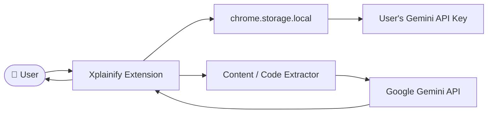

# Xplainify

**Clarity, in a click.**

Xplainify is a lightweight, AI-powered Chrome extension designed for students, developers, and anyone learning from the web. It summarizes webpages and explains code in beginner-friendly language — all powered by your own Gemini API key.

## Features
- AI-powered webpage summarization (TL;DR, Key Points, Simple Explanation)
- Automatic code detection on webpages
- Beginner-friendly code explanations (logic, important lines, concepts, analogies)
- Right-click context menu to explain selected code
- User-owned Gemini API key (no account needed, no backend)
- Local API key storage (persists across restarts)
- Light and dark mode support
- Keyboard accessible
- Privacy-focused (no tracking, no data collection)

## Tech Stack
- Chrome Extensions Manifest V3
- HTML / CSS / Vanilla JavaScript
- Google Gemini API (gemini-2.0-flash)
- Chrome Storage API
- Chrome Scripting API

## Architecture



*Note: There is no Xplainify backend. All API requests go directly from your browser to Google's Gemini API.*

## Installation

1. Clone or download this repository
   ```bash
   git clone https://github.com/yourusername/xplainify.git
   ```
2. Open Chrome and navigate to `chrome://extensions`
3. Enable **Developer Mode** (toggle in top-right)
4. Click **Load unpacked**
5. Select the `xplainify` folder
6. Click the Xplainify icon in your toolbar
7. Configure your Gemini API key in Settings

## Getting Your Gemini API Key

1. Visit [Google AI Studio](https://aistudio.google.com/app/api-keys)
2. Sign in with your Google account
3. Click **Create API Key**
4. Copy the generated key
5. Open Xplainify Settings
6. Paste and save your key

*Note: The free tier of Gemini API is sufficient for most usage.*

## Usage

1. **Summarize a Page**: Navigate to any webpage → Click Xplainify → Click "Summarize Page"
2. **Explain Code**: Visit a page with code (GitHub, MDN, Stack Overflow, etc.) → Click Xplainify → Click "Explain Code" → Select a code block → Read the explanation
3. **Context Menu**: Select code on any page → Right-click → "Xplainify → Explain Selected Code"

## Permissions

| Permission | Purpose |
|---|---|
| `activeTab` | Access the current tab's content when you click the extension |
| `scripting` | Inject content extraction scripts into the active tab |
| `storage` | Store your API key locally in Chrome |
| `contextMenus` | Add "Explain Selected Code" to the right-click menu |

## Privacy & Security

- **No backend** — all requests go directly to Google Gemini
- **Local storage only** — your API key never leaves your browser
- **No tracking** — no analytics, no data collection
- **No `eval()`** — AI output is never executed as code
- **Minimal permissions** — only what's needed
- **Safe rendering** — AI responses are sanitized before display
- **Untrusted input** — webpage content is treated as untrusted data

Link to [PRIVACY.md](./PRIVACY.md) for full details.

## Project Structure

```
xplainify/
├── manifest.json          # Extension configuration
├── popup.html/css/js      # Main popup UI
├── settings.html/css/js   # Settings page
├── background.js          # Service worker
├── content.js             # Content extraction
├── js/
│   ├── api.js             # Gemini API client
│   ├── prompts.js         # Prompt engineering
│   ├── storage.js         # Chrome storage wrapper
│   ├── extractor.js       # Content extraction logic
│   └── utils.js           # Utilities & safe rendering
├── icons/                 # Extension icons
├── README.md
├── PRIVACY.md
└── .gitignore
```

## Future Improvements

- Better code block selection UI
- Support for additional AI providers
- Local history of summaries and explanations
- Adjustable explanation difficulty level
- PDF and document support
- Keyboard shortcuts
- Export summaries to markdown
- More advanced learning modes

## Built By

Built by **Siddhesh Khankhoje** — [View Portfolio](https://siddheshk17-portfolio.vercel.app/)

## License

MIT License

